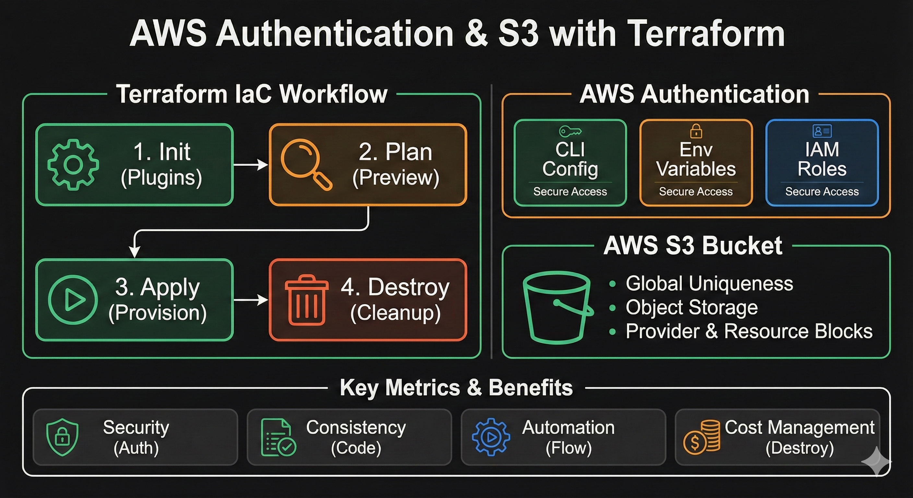

# Day 3: AWS Authentication & S3 Bucket Creation ☁️
yes

## 📝 Overview
Welcome to Day 3 of the Terraform journey! Today, we moved from theory to practice. The focus of this module is to understand how to securely connect Terraform to AWS (Authentication) and provision our first cloud resource: an **Amazon S3 Bucket**.

## 🎯 Learning Objectives
1.  **AWS Authentication:** Configuring credentials so Terraform can talk to the AWS API.
2.  **Resource Provisioning:** Writing HCL code to create an S3 bucket.
3.  **Terraform Lifecycle:** Practicing `init`, `plan`, `apply`, and `destroy`.

---

## 🔐 1. AWS Authentication Methods
Before Terraform can build anything, it needs permission. We explored two main ways to authenticate:

### Method A: AWS CLI (Recommended for Local Dev)
Using the terminal to configure credentials globally.
```bash
aws configure
# Enter Access Key ID
# Enter Secret Access Key
# Enter Region (e.g., us-east-1)

Method B: Environment Variables

Setting keys temporarily in the session (good for keeping keys out of code).

export AWS_ACCESS_KEY_ID="your_access_key"
export AWS_SECRET_ACCESS_KEY="your_secret_key"
export AWS_DEFAULT_REGION="us-east-1"

🪣 2. The Resource: AWS S3 Bucket

We used the aws_s3_bucket resource.

Key Rule: S3 Bucket names must be Globally Unique. This means if someone else in the world has taken a name, you cannot use it.

Code Snippet (main.tf)
provider "aws" {
  region = "us-east-1"
}

resource "aws_s3_bucket" "my_bucket" {
  bucket = "tanish-terraform-day3-bucket-unique-id"  # Change this name!
  
  tags = {
    Name        = "My bucket"
    Environment = "Dev"
  }
}


🚀 How to Run This Project

Follow these steps to provision the infrastructure:

Step 1: Initialize Downloads the AWS provider plugins required for the code.
Step 1: Initialize Downloads the AWS provider plugins required for the code.
Bash

terraform init

Step 2: Validate Checks if the syntax of the code is correct.
#Bash

terraform validate

Step 3: Plan Shows a preview of what Terraform will create. Always review this!
#Bash

terraform plan

Step 4: Apply Executes the plan and creates the S3 bucket in your AWS account.
#Bash

terraform apply
# Type 'yes' when prompted

Step 5: Destroy (Cleanup) Removes the bucket to prevent unwanted costs.
#Bash

terraform destroy

⚠️ Important Notes

    Cost: While S3 is often free-tier eligible, always run terraform destroy after practice to ensure zero costs.

    Errors: If you get a BucketAlreadyExists error, simply change the bucket name in main.tf to something unique.

📚 Resources

    Terraform AWS Provider Documentation - https://registry.terraform.io/providers/hashicorp/aws/latest/docs
    
    🎥 YouTube Reference: Piyush sachdeva  https://lnkd.in/gpYkcAig

    📂 Documentation: https://lnkd.in/gNxw_h-z

    
