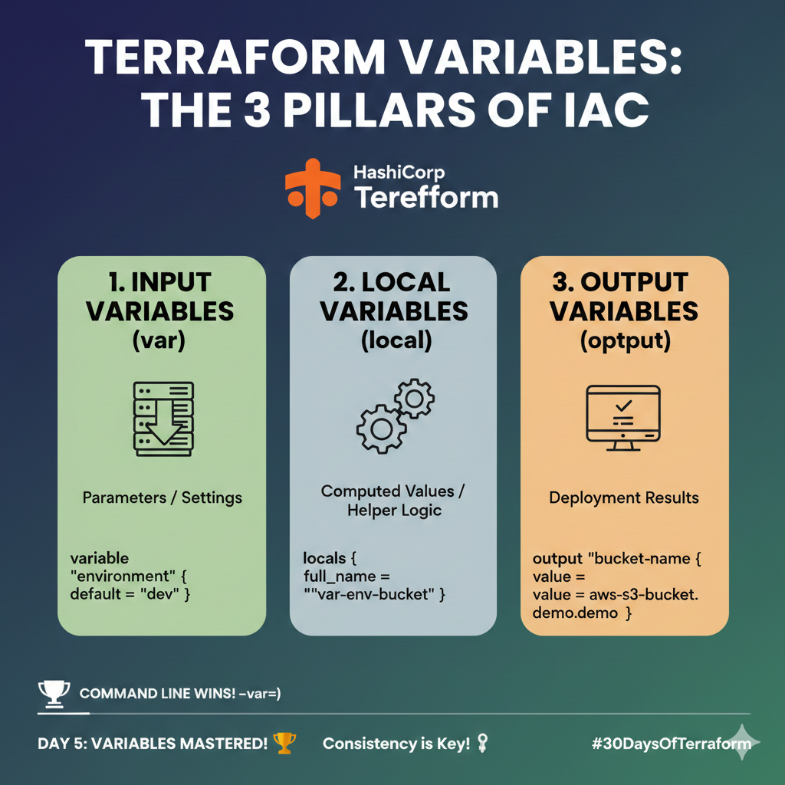

# 🚀 Day 05: Mastering Variables in Terraform (The 3 Pillars of Reusability)

Welcome to Day 5 of the challenge! Today, we transformed our static configurations into flexible, reusable blueprints by mastering the three types of Terraform Variables.

---

## 🎯 Key Learning: Why Variables?

**The Problem:** Hardcoding values (like environment names or region) means you have to manually edit your code for every deployment. This leads to errors and slow scaling.

**The Solution:** Variables allow you to customize your configurations without changing the underlying code. You define a variable once and use its placeholder everywhere.

---

## 🏗️ The 3 Types of Variables

Terraform uses three main types of variables, each serving a distinct purpose in the configuration lifecycle:

| Variable Type | Purpose | Analogy | File Location | Prefix Used |
| :--- | :--- | :--- | :--- | :--- |
| **1. Input (`var`)** | **Parameters:** Values passed *into* the configuration from the outside. | **Game Settings** (e.g., Difficulty: Easy/Hard) | `variables.tf` | `var.` |
| **2. Local (`local`)** | **Computed Values:** Internal calculations and reusable expressions for complex names or tags. | **Rough Work** (e.g., combining names) | `locals.tf` | `local.` |
| **3. Output (`output`)** | **Deployment Results:** Information displayed *after* the infrastructure is successfully created. | **Final Scorecard** (e.g., Your final score/ID) | `output.tf` | N/A |

### Practical Example Overview (S3 Bucket Demo)

In the demo, we created a single S3 bucket that utilized all three types:

1.  **Input:** Used `var.environment` to tag the bucket.
2.  **Local:** Used `local.full_bucket_name` to combine the environment, name, and a unique suffix for the bucket name.
3.  **Output:** Used `output.bucket_arn` to show the final, live address of the bucket after deployment.

---

## 🥇 Understanding Variable Precedence

When multiple values are provided for a single Input Variable, Terraform follows a strict order to decide which value to use. The highest precedence wins:

1.  **Command Line Flags (`-var`)** 🏆
2.  **Specific Variable Files (`-var-file=...`)**
3.  **Auto-Loaded Files (`terraform.tfvars` / `*.auto.tfvars`)**
4.  **Environment Variables (`TF_VAR_...`)**
5.  **Default Values** (defined in `variables.tf`)

---

## 🧪 Key Commands Used Today

| Command | Purpose |
| :--- | :--- |
| `terraform init` | Initializes the working directory and downloads necessary provider plugins. |
| `terraform plan` | Generates an execution plan showing what will be created/changed **before** deployment. |
| `terraform plan -var="environment=prod"` | Overrides all other values, forcing the environment to be **production**. |
| `terraform apply` | Executes the plan and provisions the infrastructure. |
| `terraform output` | Displays the values defined in the `output.tf` file. |
| `terraform destroy` | Safely removes all resources defined by the configuration. |

---

## 💡 Key Takeaway

Mastering variables is the single most important step toward writing truly reusable, professional **Infrastructure as Code (IaC)**.

**Consistency is Key!** See you on Day 6!