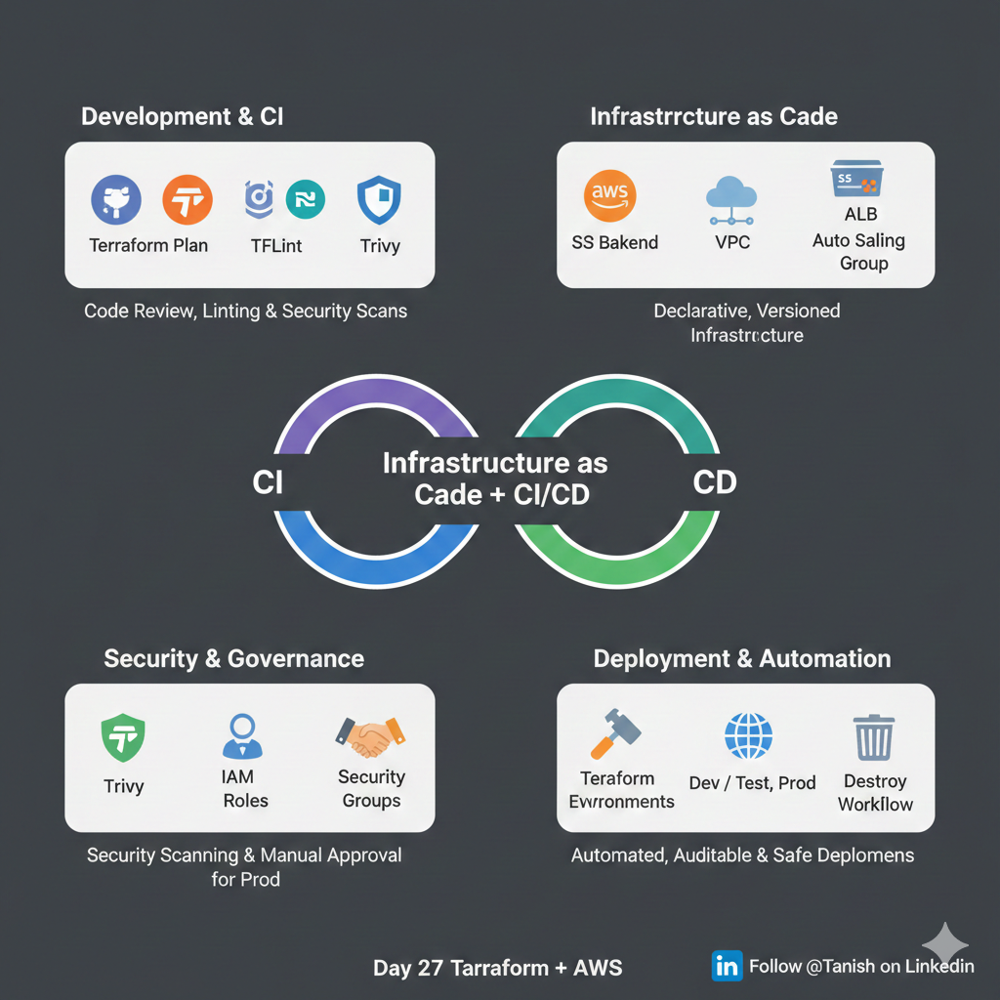

# 🚀 Day 27 – Terraform + AWS CI/CD Automation

## 📌 Overview

This repository documents my **Day 27 learning** in the Terraform + AWS journey, where I focused on building a **production-ready CI/CD pipeline for Infrastructure as Code (IaC)** using **Terraform** and **GitHub Actions**.

The goal was simple but powerful:

> **Stop managing infrastructure manually and start deploying it safely, automatically, and audibly using CI/CD pipelines.**

---

## 🧠 Big Picture: What Is This About?

**Terraform + GitHub Actions = Automated Infrastructure Factory**

Instead of:

* Logging into AWS manually
* Running `terraform plan` and `terraform apply` from a local machine

We use:

* **Terraform** to define infrastructure as code
* **GitHub Actions** to automate validation, security checks, approvals, and deployments

This approach is known as:

> **Infrastructure as Code (IaC) + CI/CD Automation**

---

## ❓ Why Do We Need This?

In real-world teams:

* Multiple engineers work on the same AWS account
* Manual changes increase the risk of outages
* Production environments must be protected

### 🚫 Problems Without CI/CD

* Human errors
* No security validation
* No approval mechanism
* No audit trail

### ✅ Benefits With CI/CD

* Safer deployments
* Consistent infrastructure
* Security and compliance checks
* Clear visibility into who changed what
* Production-ready workflows

---

## 🏗️ What Was Built (Architecture Overview)

The infrastructure is a **Highly Available Two-Tier Architecture** on AWS:

* VPC with Public and Private Subnets
* Application Load Balancer (ALB)
* Auto Scaling Group (ASG)
* NAT Gateway for private subnet access
* S3 Backend for Terraform state management

All components are defined declaratively using Terraform.

---

## ⚙️ CI/CD Pipeline Design (GitHub Actions)

The pipeline is divided into two major stages:

### 🔍 1. Terraform Plan (On Pull Request)

Triggered when a Pull Request is created.

Steps include:

* Checkout code
* Terraform formatting and linting using **TFLint**
* Security scanning using **Trivy**
* Generate `terraform plan` for review

📌 No infrastructure changes happen at this stage.

---

### 🚀 2. Terraform Apply (On Merge)

Triggered when the PR is merged into the main branch.

Steps include:

* Fetch approved Terraform plan
* Apply changes to AWS
* Update or create infrastructure automatically

For **production environments**, manual approval is required using GitHub Environments.

---

## 🔐 Security & Governance

Security and governance are first-class citizens in this setup:

* **GitHub Secrets** are used to store AWS credentials securely
* **Trivy** scans Terraform code for misconfigurations (open ports, public exposure)
* **Manual approval gates** protect production deployments
* **Audit trail** available via GitHub Actions logs

---

## 🧹 Destroy Workflow

A separate GitHub Actions workflow is configured to:

* Destroy infrastructure safely
* Accept environment input (dev / test / prod)
* Prevent accidental deletions

This helps with cost optimization and cleanup.

---

## 🧪 Hands-on Validation

To validate the pipeline:

* Auto Scaling Group desired capacity was updated
* Change was pushed via Pull Request
* Pipeline validated, approved, and applied
* AWS reflected the change automatically

This confirmed the pipeline works end-to-end.

---

## 🌍 Real-World Relevance

This workflow mirrors how **modern DevOps and Cloud teams** operate:

* Infrastructure changes go through reviews
* Security checks are mandatory
* Production changes require approval
* Everything is automated and repeatable

Used widely in:

* Startups
* Product-based companies
* Enterprise and MNC environments

---

## 💡 Key Learnings

* Manual infrastructure changes do not scale
* CI/CD is not only for application code
* Infrastructure deserves the same discipline as software
* Automation increases both speed and safety

---

## 🙏 Gratitude & Inspiration

* **Piyush Sachdeva** – for clear and practical learning resources
* **Ankur Warikoo** – for inspiring structured thinking
* **Savinder Puri** – for promoting the *Learn in Public* mindset

---

## 📈 Final Thoughts

This setup challenged how I think about:

* Speed vs stability
* Automation vs control
* Protecting production systems

With gratitude and consistent learning, this journey is helping me grow toward a **production-ready DevOps mindset**.

---

## 🔗 Tags

#Terraform #AWS #GitHubActions #DevOps #CloudComputing #Automation #InfrastructureAsCode #LearnInPublic #GrowthMindset

---

⭐ If you find this useful, feel free to explore, fork, or share feedback!
