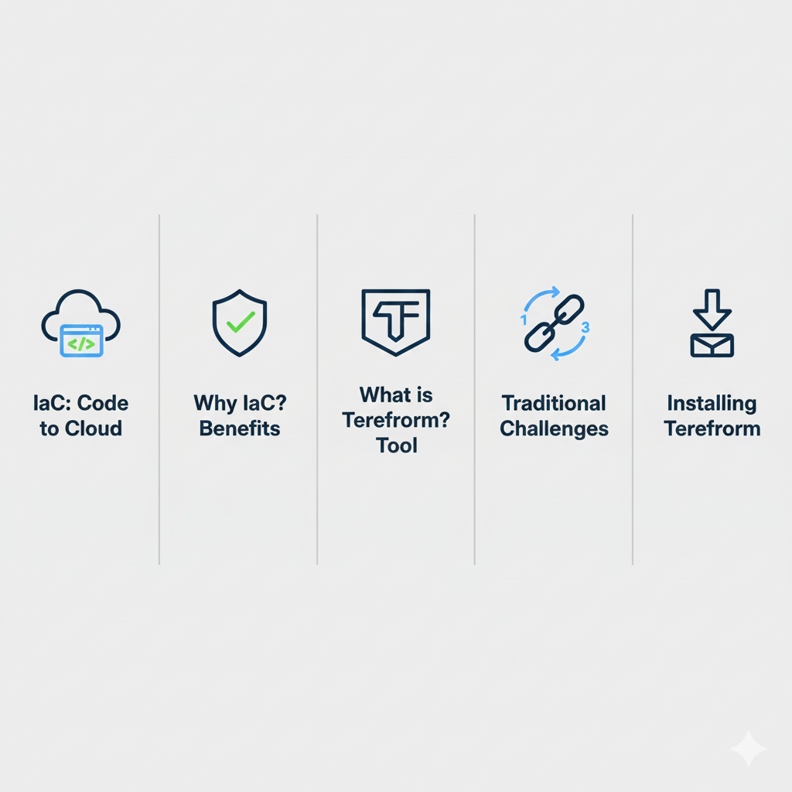
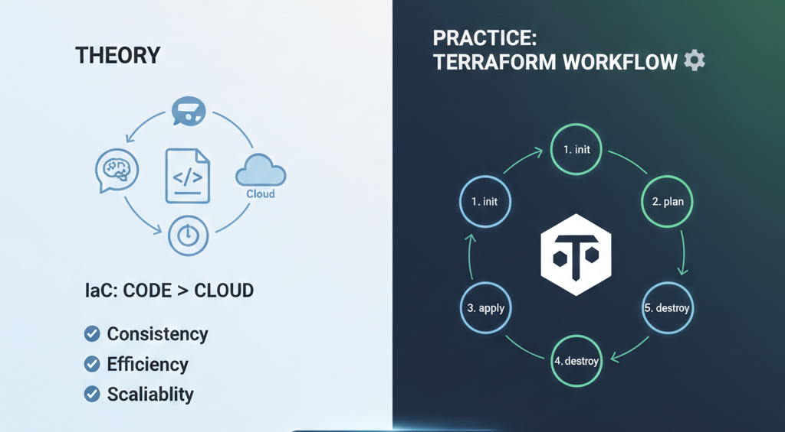

## 🚀 30 DAYS OF TERRAFORM CHALLENGE: Mastering IaC

This repository documents my 30-day journey into learning and implementing Infrastructure as Code (IaC) using Terraform.

---

## 📅 DAY 01: Introduction & Environment Setup

### 1. 💡 Topics Covered: Core Theory

This section focused on understanding the fundamentals of automating infrastructure delivery.

* **What is Infrastructure as Code (IaC)?**
    * It is the practice of defining and managing infrastructure (Servers, Networking, Databases) using **code files** (e.g., `.tf` files) instead of manual configuration. This ensures **consistency** and **repeatability**. 

* **Why We Need IaC?**
    * **Eliminate Human Error:** Removes mistakes that happen during manual setup and clicking.
    * **Consistency:** Ensures that Development, Staging, and Production environments remain **identical** (avoiding the "it works on my machine" problem).
    * **Version Control:** Allows infrastructure changes to be **tracked** and managed like application code using Git.

### 2. 🛠️ Tool: Terraform Workflow

I learned how Terraform operates and its essential lifecycle for provisioning resources.

* **Terraform Workflow:** These are the five sequential steps Terraform follows when managing infrastructure:
    1.  **`terraform init`**: **Initialize** the working directory and download necessary **providers** (plugins).
    2.  **`terraform validate`**: Check the configuration code (HCL) for syntax errors.
    3.  **`terraform plan`**: Show a **preview** of the changes that will be executed (what will be created, changed, or destroyed).
    4.  **`terraform apply`**: **Execute** the plan, making API calls to the cloud provider (like AWS) to provision resources.
    5.  **`terraform destroy`**: **Safely delete** all managed resources (crucial for cost management). 

### 3. 🖥️ Key Achievements: Environment Setup

These are the practical steps successfully completed to enable hands-on practice:

* **Environment Setup (WSL):** Successfully set up the **Windows Subsystem for Linux (WSL)** to create a native Linux/Bash environment on Windows. This allows running Linux commands, including the required `alias tf=terraform` from tutorials.
* **Terraform Installation:** Installed the Terraform executable inside the WSL environment using the official **HashiCorp APT repository**.
* **Verification:** Confirmed the installation by running `tf -v` (and `terraform -v`), proving the tool is fully accessible in the terminal.

### 📚 Resources:
- **Tutorial Link:** https://youtu.be/s5fwSG_00P8?si=nyjy8-Tat8u1f-1w
